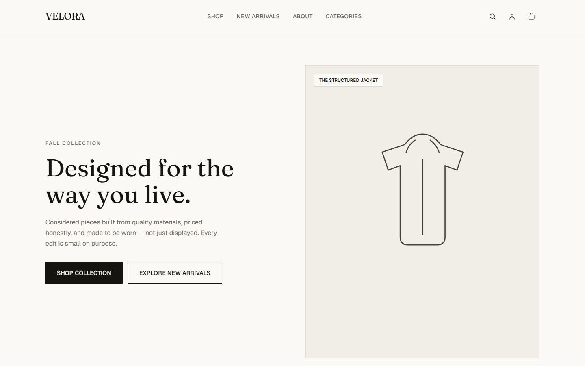
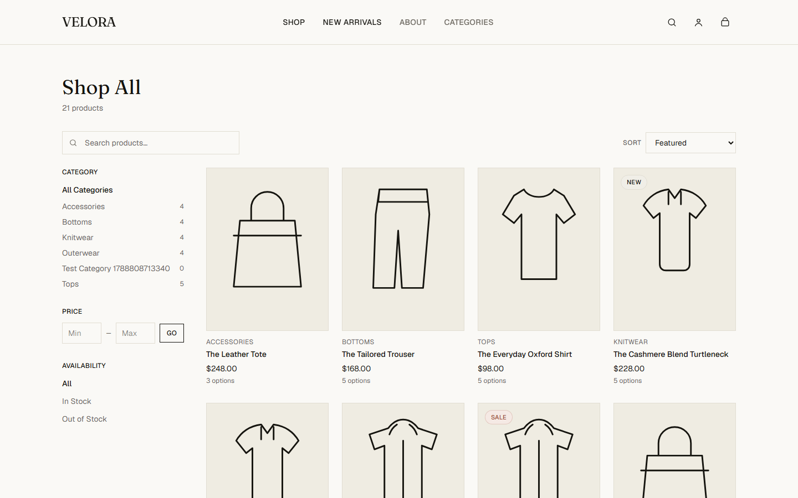
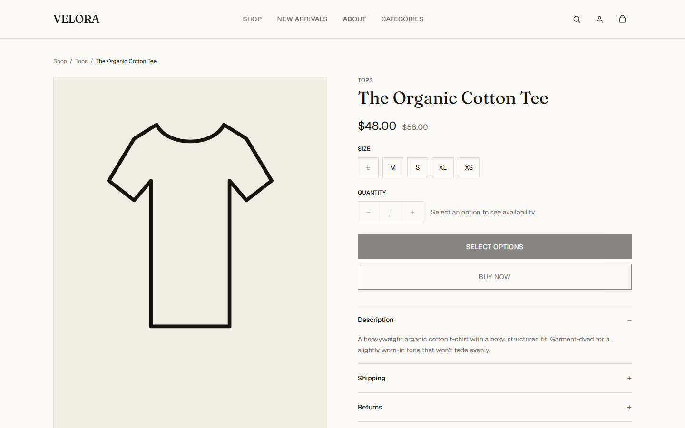
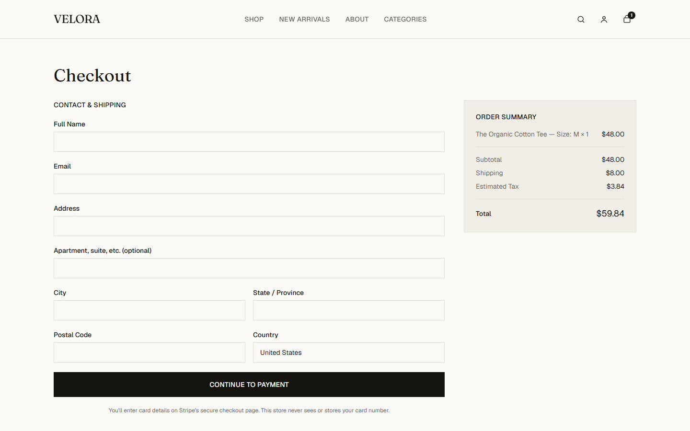
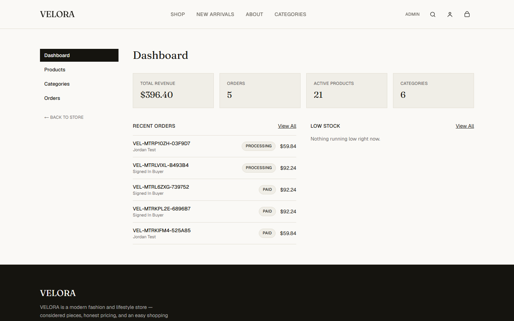
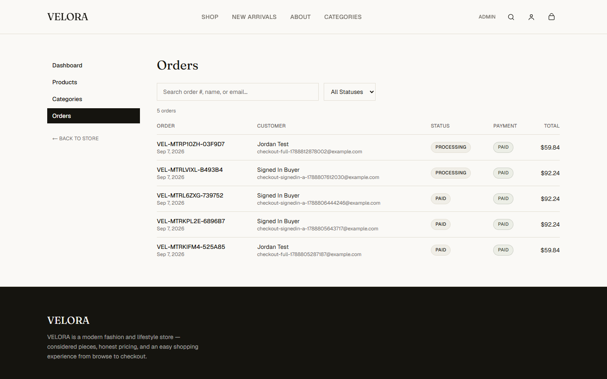

# VELORA

A production-quality, full-stack e-commerce application for a fictional premium fashion/lifestyle brand — built as a portfolio piece to demonstrate a **real, working online store**, not a static storefront template.

**Live demo:** https://velora-tau-brown.vercel.app
**Repo:** https://github.com/tahaimtiazdev-cloud/velora

Every number on the live demo's admin dashboard is real — it's computed from actual orders placed through actual Stripe test-mode payments during development and testing, not seeded or hardcoded.

## Screenshots

| | |
|---|---|
|  |  |
|  |  |
|  |  |

## What this proves

This isn't a catalog with a fake "Buy" button. Building it required solving the problems a real store actually has:

- **Never trust the client.** Every price, stock level, and total is recomputed from the database at the moment it matters — cart, checkout, and order creation all independently re-derive these rather than accepting anything sent from the browser. Verified directly: depleting a product's stock *after* it's added to a cart but *before* checkout is submitted correctly blocks the purchase server-side.
- **Payment confirmation that can't be faked.** An `Order` row is created in exactly one place — a Stripe webhook handler that verifies the event's cryptographic signature and checks `payment_status === "paid"`. Reaching the success page after checkout proves nothing on its own; a `PendingCheckout` snapshot bridges session-creation and webhook-fulfillment so the order reflects what Stripe actually charged, not a re-fetched "current" price.
- **Idempotency.** `Order.paymentReference` is a unique column, so a retried webhook delivery (which Stripe does on any non-2xx response, and which real payment processors do in general) can never create a duplicate order. Verified by replaying an identical signed webhook event and confirming no duplicate was created.
- **Role-gated admin, enforced server-side only.** Every `/admin` page and Server Action independently resolves the user's role from the server-verified session — never a client-supplied value — and a non-admin gets a 404 rather than a login redirect, so the area's existence isn't disclosed.
- **Guest-to-account continuity.** A guest cart merges into an account's existing cart on login/registration, with quantities summed and clamped to live stock — verified with a case where an account already had an item and the guest cart added more of the same item.

## Tech stack

- [Next.js 16](https://nextjs.org) (App Router, Server Actions) + TypeScript
- Tailwind CSS v4
- PostgreSQL ([Neon](https://neon.tech), serverless, driver-adapter based — no Rust query engine)
- [Prisma ORM](https://www.prisma.io) 7
- [Auth.js](https://authjs.dev) v5 (Credentials provider, JWT sessions)
- [Stripe](https://stripe.com) Checkout (test mode)
- [Resend](https://resend.com) for order-confirmation email (optional — failure never blocks an order)
- Deployed on [Vercel](https://vercel.com)

## Features

**Storefront** — product catalog with search, category/price/availability filtering, sorting, and pagination (all database-backed, not client-side filtering of a preloaded list); product detail pages with variant selection and live stock; a persistent cart for guests and signed-in users alike.

**Accounts** — registration and login, protected `/account` and `/account/orders`, guest-cart merge on sign-in.

**Checkout** — real Stripe test-mode payment, server-computed shipping/tax, order confirmation page, order history and per-order detail pages.

**Admin dashboard** — real-data metrics (revenue, orders, low stock), product CRUD (including per-variant stock, add/remove images), category CRUD, order fulfillment-status management, all with database-backed search and pagination.

**Hardening** — `sitemap.xml` and `robots.txt`, JSON-LD structured data (`Organization`, `WebSite`, `Product`), baseline security headers, root-level error boundaries, and a zero-violation result from an automated WCAG 2 AA accessibility sweep (axe-core) across 15 representative pages spanning guest, customer, and admin views.

## Getting started

```bash
npm install
```

Copy `.env.example` to `.env` and fill in a `DATABASE_URL` (a free [Neon](https://neon.tech) project works well) and `AUTH_SECRET` (`npx auth secret`). Stripe and Resend keys are optional for browsing/admin work but required for checkout — see the comments in `.env.example` for where to get each one and, importantly, why `NEXT_PUBLIC_SITE_URL` has to be set as a **real deployment environment variable** (not just a local file) once you deploy, since it drives Stripe's redirect URLs and is inlined at build time.

```bash
npx prisma migrate dev
npx prisma db seed
npm run dev
```

Open [http://localhost:3000](http://localhost:3000).

If you run a **production build locally** (`npm run build && npm run start`) rather than `npm run dev`, also set `AUTH_TRUST_HOST=true` — Auth.js otherwise refuses to trust `localhost` outside of dev mode, which silently breaks sign-in. This isn't needed on Vercel.

### Demo accounts

Seeded by `prisma/seed.ts` — demo data only, not real credentials:

| Role | Email | Password |
|---|---|---|
| Admin | `admin@velora.example` | `VeloraAdmin123!` |
| Customer | `customer@velora.example` | `VeloraCustomer123!` |

Use Stripe's test card `4242 4242 4242 4242`, any future expiry, any CVC, to complete a checkout.

## Project structure

```
prisma/
  schema.prisma        Database schema
  seed.ts               Seed script (categories, products, variants, demo users)
src/
  app/                  Route segments + API routes
    admin/              Role-gated dashboard, product/category/order management
    api/webhooks/stripe/  Signature-verified payment confirmation
    checkout/           Checkout form + post-payment success page
  components/
    ui/                 Generic primitives (Button, Container, Section, Badge, ...)
    admin/, checkout/, auth/, cart/, product/, shop/, layout/, home/
  lib/
    db.ts               Prisma client (Neon driver adapter)
    auth/guards.ts       requireUser() / requireAdmin() — the real authorization checks
    cart/                Guest/user cart-owner resolution and merge logic
    checkout/            Pricing, order-number generation, checkout snapshot validation
    queries/, actions/    Data access and Server Actions, grouped by domain (admin/ subfolders too)
```

## Architecture notes

**Cart identity.** A single `CartOwner` abstraction (`src/lib/cart/owner.ts`) resolves either a signed-in user's cart or a guest's cookie-token cart, so every cart query/mutation works identically for both — including the merge that happens on login.

**Stock model.** Products with variants (e.g. sizes) track stock **per variant**; a product's own `stock` field is only authoritative when it has no variants (`src/lib/inventory.ts`). Both the storefront's "in stock" filter and checkout's availability check share this rule.

**Order fulfillment vs. payment status are separate columns on purpose** (`OrderStatus` vs. `PaymentStatus`). Admins can change fulfillment status (processing, shipped, etc.); `paymentStatus` is exclusively set by the verified Stripe webhook and has no admin-facing control, so a payment can never be hand-marked as settled.

**Why Server Actions over API routes almost everywhere.** Keeps mutations co-located with the validation and authorization they need, and Next.js's built-in CSRF protection for Server Actions applies automatically. The one exception is the Stripe webhook, which necessarily has to be a Route Handler (it's called by Stripe's servers, not the browser).

## Known limitations

Documented rather than hidden, since a real audit would find these too:

- No rate limiting on login/register — would need external state (e.g. Upstash Redis) not currently provisioned.
- Product image management is a plain URL/alt-text field, not a real upload pipeline — no object storage is wired up.
- No bulk admin actions (bulk delete/status-change) or CSV export.
- No audit log of admin changes.
- Abandoned checkouts leave a harmless orphaned `PendingCheckout` row (never converted to an order) with no automated cleanup job.
- No global Content-Security-Policy header — attempted but skipped after weighing the risk of breaking the Stripe redirect flow against the benefit, given the existing header set (X-Frame-Options, X-Content-Type-Options, Referrer-Policy, Permissions-Policy) already covers the most common attack classes.

## Testing approach

No automated test suite ships in the repo (this was built and verified interactively, stage by stage), but every stage was tested with real Playwright scripts against **both** a local production build and the live Vercel deployment before being considered done — registration/login/logout, guest-cart-to-account merge, full Stripe checkout with a real test-card payment, webhook idempotency (replaying a signed event), server-side stock revalidation (depleting stock mid-checkout), admin CRUD and role-gating, and a 15-page axe-core accessibility sweep. See the commit history for how each stage was verified.

## Scripts

- `npm run dev` / `npm run build` / `npm run start` / `npm run lint`
- `npm run db:migrate` — create/apply a migration in development
- `npm run db:deploy` — apply migrations in production
- `npm run db:seed` — re-run the seed script
- `npm run db:studio` — open Prisma Studio

## Status

**Feature-complete and portfolio-ready.** Catalog, cart, authentication, Stripe checkout, and an admin dashboard are all built, tested against both a local production build and the live deployment, and deployed. See commit history for the stage-by-stage build log.
